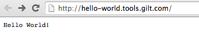

# Deploy 'Hello World!' service 

Source code: https://github.com/gilt/hello-world

DockerHub: https://hub.docker.com/r/giltouroboros/hello-world

## Prepare configuration json

Fill required values and save config to hello-world-config.json.
<table cellpadding="10">
    <tr>
        <td>
<pre><code>{
    "url":<a href ="deployingServices.md#decide-on-the-domain-for-your-service">"&lt;URL&gt;"</a>, 
    "hosted_zone_id":<a href ="deployingServices.md#decide-on-the-domain-for-your-service">"&lt;HOSTED_ZONE_ID&gt;"</a>,
    "aws_account_id":<a href ="deployingServices.mdgettingStarted.md#prepare-aws-account">"&lt;AWS_ACCOUNT_ID&gt;"</a>,
    "service_role":<a href ="deployingServices.md#create-service_name-role">"&lt;SERVICE_ROLE&gt;"</a>,
    "image": "<a href="https://hub.docker.com/r/giltouroboros/hello-world">giltouroboros/hello-world</a>",
    "port_mappings": [
        {
            "internal": 9000,
            "external": 9000
        }
    ],
    "run_args": [
        "-Dpidfile.path=/dev/null"
    ],
    "eb": {
        "deployment_bucket":<a href ="deployingServices.md#create-s3-deployment-bucket">"&lt;DEPLOYMENT_BUCKET&gt;"</a>,
        "settings": []
    },
    "remove_unused_after_minutes": 1
}</code></pre> </td>
        <td valign="top">
<i>Notes</i>
<br/><br/>
<b>url</b>: Unique endpoint for each service hosted_zone_id: Unique for each AWS account!
<br/><br/>
<b>run_args</b>: run arguments for service.<br/><code>pidfile.path=/dev/null</code><br/>is required for restarting Play apps withing Docker container.
<br/><br/>
<b>remove_unused_after_minutes</b>: optional; default 60min       
        </td>
    </tr>
</table>

## Add service config to ION-Roller

```bash
ionroller set_config hello-world /<PATH_TO_CONFIG>/hello-world-config.json
```

## Deploy

```bash
ionroller release hello-world 1.0.0
```

## Enjoy!

Your service should be available at <a href ="deployingServices.md#decide-on-the-domain-for-your-service">"&lt;URL&gt;"</a>


## Advanced security settings

If you want your url to be accesible only within private network you can play with security settings. Learn about [VPCs and Subnets](gettingStarted.md#minimum-viable-aws-knowledge). Then update your config to:

<table cellpadding="10">
    <tr>
        <td><pre><code>{
    "url":<a href ="deployingServices.md#decide-on-the-domain-for-your-service">"&lt;URL&gt;"</a>, 
    "hosted_zone_id":<a href ="deployingServices.md#decide-on-the-domain-for-your-service">"&lt;HOSTED_ZONE_ID&gt;"</a>,
    "aws_account_id":<a href ="deployingServices.mdgettingStarted.md#prepare-aws-account">"&lt;AWS_ACCOUNT_ID&gt;"</a>,
    "service_role":<a href ="deployingServices.md#create-service_name-role">"&lt;SERVICE_ROLE&gt;"</a>,
    "image": "<a href="https://hub.docker.com/r/giltouroboros/hello-world">giltouroboros/hello-world</a>",
    "port_mappings": [
        {
            "internal": 9000,
            "external": 9000
        }
    ],
    "run_args": [
        "-Dpidfile.path=/dev/null"
    ],
    "eb": {
        "deployment_bucket":<a href ="deployingServices.md#create-s3-deployment-bucket">"&lt;DEPLOYMENT_BUCKET&gt;"</a>,
         <a href ="http://docs.aws.amazon.com/elasticbeanstalk/latest/dg/command-options.html">"settings"</a>: [
           {
               "Namespace":"aws:ec2:vpc",
               "OptionName":"VPCId",
               "Value":<a href ="gettingStarted.md#minimum-viable-aws-knowledge">"&lt;VPC_ID&gt;"</a>
            },
            {
                "Namespace": "aws:ec2:vpc",
                "OptionName": "ELBScheme",
                "Value": "internal"
            },
            {
                "Namespace": "aws:ec2:vpc",
                "OptionName": "Subnets",
                "Value": <a href ="gettingStarted.md#minimum-viable-aws-knowledge">"&lt;SUBNET_ID&gt;"</a>
            },
            {
                "Namespace": "aws:ec2:vpc",
                "OptionName": "ELBSubnets",
                "Value": <a href ="gettingStarted.md#minimum-viable-aws-knowledge">"&lt;SUBNET_ID&gt;"</a>
            }
        ]
    },
    "remove_unused_after_minutes": 1
}</code></pre></td>
        <td valign="top">
<i>Notes</i>
<br/><br/>
<b>url</b>: Unique endpoint for each service hosted_zone_id: Unique for each AWS account!
<br/><br/>
<b>run_args</b>: run arguments for service.<br/><code>pidfile.path=/dev/null</code><br/>is required for restarting Play apps withing Docker container.
<br/><br/>
<b>VPCId</b>: optional; you don't need VPC ID if you specify a subnet in the VPC
<br/><br/>
<b>Subnets</b>: There should be a Subnet for each ELBSubnet, with matching availability zones (in the standard cases, the value of Subnets equals that of ELBSubnets)
<br/><br/>
<b>ELBScheme</b>: private - only connectable from internal VPCs; internal - only connectable from a trusted IP, i.e. VPN, offices etc.; public - the world. Default: internal
<br/><br/>
<b>remove_unused_after_minutes</b>: optional; default 60min       
        </td>
    </tr>
</table>
