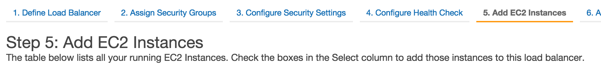
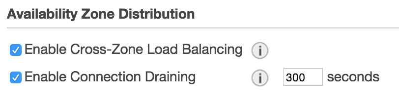

# Deploying services

## Before you deploy a new service...

### Create *SERVICE_NAME* role 
This role will be used as [InstanceProfile](http://docs.aws.amazon.com/IAM/latest/UserGuide/roles-usingrole-ec2instance.html) for running your service.

[AWS] (https://console.aws.amazon.com/) -> Identity and Access Management -> Roles

Role Name: \<SERVICE_NAME\>

Select Role Type: **Amazon EC2 (Allows EC2 instances to call AWS services on your behalf.)** 

Attach policy: AmazonS3ReadOnlyAccess for the minimum required permissions

*Think of all the resources that your service needs to access like DynamoDB, RDS (Postgres), etc...*

### (Optional) Set up an external load balancer for more control over traffic migration
[AWS] (https://console.aws.amazon.com/) -> EC2 -> Load Balancers -> Create Load Balancer

You may (optionally) create a load balancer which exists independently from the Elastic Beanstalk environments, and will always point at the current release. After a successful rollout, traffic will be gradually moved from the old environment to the new environment.

The load balancer should be set up in a VPC and subnet, with access to the EC2 instances that will be set up by the service. The health check should also be configured appropriately for your service.

You will also want to consider the "Connection Draining" setting for the load balancer, as this affects how quickly traffic can be migrated (existing connections to an EC2 backend will not be terminated until this amount of time has passed).





## Deploy 'hello-world' service 

As a warmup follow [steps to deploy an example 'hello-world' service](deployHelloService.md).

## Let's (ION-)roll! On to the actual deployment

###  Add your service configuration to ION-Roller
Prepare a JSON file with the configuration for your service, e.g. my-service-config.json.

If there are any services configured already, you can start with the getting the config of one of them, e.g.:

```bash
ionroller config my-service > my-service-config.json
```

Configuration template:
<table cellpadding="10">
    <tr>
        <td>
       <pre><code>{
   "url":<a href ="gettingStarted.md#decide-on-the-domain-for-your-services">"&lt;URL&gt;"</a>, 
   "hosted_zone_id":<a href ="gettingStarted.md#decide-on-the-domain-for-your-service">"&lt;HOSTED_ZONE_ID&gt;"</a>,
   "aws_account_id":<a href ="gettingStarted.md#prepare-aws-account">"&lt;AWS_ACCOUNT_ID&gt;"</a>,
   "service_role":<a href ="#create-service_name-role">"&lt;SERVICE_ROLE&gt;"</a>,
   "image":<a href ="gettingStarted.md#build-docker-image">"&lt;DOCKER_REPOSITORY&gt;/&lt;IMAGE&gt;"</a>,
   "port_mappings":[
      {
         "internal":&lt;INTERNAL_PORT&gt;,
         "external":&lt;EXTERNAL_PORT&gt;
      }
   ],
   "volume_mappings":[],
   "run_args":[
      "-Dpidfile.path=/dev/null",
      "-DtestProperty=HelloWorld"
    ],
   "eb":{
      "deployment_bucket":<a href ="gettingStarted.md#create-s3-deployment-bucket">"&lt;DEPLOYMENT_BUCKET&gt;"</a>,
      <a href="http://docs.aws.amazon.com/elasticbeanstalk/latest/dg/concepts.platforms.html">"stack"</a>:"64bit Amazon Linux 2015.03 v2.0.0 running Docker 1.6.2",
      <a href ="http://docs.aws.amazon.com/elasticbeanstalk/latest/dg/command-options.html">"settings"</a>:[
         {
            "Namespace":"aws:ec2:vpc",
            "OptionName":"VPCId",
            "Value":<a href ="gettingStarted.md#minimum-viable-aws-knowledge">"&lt;VPC_ID&gt;"</a>
         },
         {
            "Namespace":"aws:ec2:vpc",
            "OptionName":"Subnets",
            "Value":<a href ="gettingStarted.md#minimum-viable-aws-knowledge">"&lt;SUBNET_ID&gt;"</a>
         },
         {
            "Namespace":"aws:ec2:vpc",
            "OptionName":"ELBSubnets",
            "Value":<a href ="gettingStarted.md#minimum-viable-aws-knowledge">"&lt;SUBNET_ID&gt;"</a>
         },
         {
            "Namespace":"aws:autoscaling:launchconfiguration",
            "OptionName":"SecurityGroups",
            "Value":<a href ="gettingStarted.md#minimum-viable-aws-knowledge">"&lt;SECURITY_GROUP_ID&gt;"</a>
         },
         {
            "Namespace":"aws:ec2:vpc",
            "OptionName":"AssociatePublicIpAddress",
            "Value":"true"
         },
         {
            "Namespace":"aws:ec2:vpc",
            "OptionName":"ELBScheme",
            "Value":"public"
         },
         {
            "Namespace":"aws:elb:loadbalancer",
            "OptionName":"CrossZone",
            "Value":"true"
         },
         {
            "Namespace":"aws:autoscaling:launchconfiguration",
            "OptionName":"InstanceType",
            "Value":<a href="https://aws.amazon.com/ec2/instance-types/">"t2.medium"</a>
         },
         {
            "Namespace":"aws:autoscaling:asg",
            "OptionName":"MinSize",
            "Value":"2"
         },
         {
            "Namespace":"aws:autoscaling:asg",
            "OptionName":"MaxSize",
            "Value":"4"
         },
         {
            "Namespace":"aws:autoscaling:launchconfiguration",
            "OptionName":"EC2KeyName",
            "Value":<a href ="gettingStarted.md#create-ssh-keys-to-enable-logging-in-to-the-amazon-ec2-instances">"&lt;KEYNAME&gt;"</a>
          }
      ],
      <a href="http://docs.aws.amazon.com/elasticbeanstalk/latest/dg/environment-resources.html">"resources"</a>: {
            "&lt;RESOURCE_ID&gt;":{
              "Type":"&lt;CLOUDFORMATION_TYPE&gt;",
              "Properties":{
                "&lt;PROPERTY_NAME1&gt;":"&lt;PROPERTY_VALUE1&gt;",
                "&lt;PROPERTY_NAME2&gt;":"&lt;PROPERTY_VALUE2&gt;"
              },
            },     
          },
      },
      <a href="http://docs.aws.amazon.com/elasticbeanstalk/latest/dg/customize-containers-ec2.html#customize-containers-format-files">"files"</a>: {
            "&lt;TARGET_FILE_LOCATION_ON_DISK&gt;": {
                "owner": "&lt;OWNER&gt;",
                "mode": "&lt;MODE&gt;",
                "content": "&lt;CONTENT&gt;",
                "group": "&lt;GROUP&gt;"
            }
        }
    },
    "remove_unused_after_minutes":1
}</code></pre>
        </td>
        <td valign="top">
<i>Notes</i>
<br/><br/>
<b>url</b>: Unique endpoint for each service hosted_zone_id: Unique for each AWS account!
<br/><br/>
<b>volume_mappings</b>: optional 
<br/><br/>
<b>run_args</b>: run arguments for service.<br/><code>pidfile.path=/dev/null</code><br/>is required for restarting Play apps withing Docker container.
<br/><br/>
<b>stack</b>: optional; default is latest Docker stack
<br/><br/>
<b>Subnets</b>: There should be a Subnet for each ELBSubnet, with matching availability zones (in the standard cases, the value of Subnets equals that of ELBSubnets)
<br/><br/>
<b>ELBScheme</b>: private - only connectable from internal VPCs; internal - only connectable from a trusted IP, i.e. VPN, offices etc.; public - the world. Default: internal
<br/><br/>
<b>CrossZone</b>: Allow ELBs to send traffic to other availability zones
<br/><br/>
<b>InstanceType</b>: optional; default t2.small
<br/><br/>
<b>MinSize</b>: optional; default 1
<br/><br/>
<b>MaxSize</b>: optional; default 4 for autoscaling
<br/><br/>
<b>EC2KeyName</b>: optional; enables ssh to your instance
<br/><br/>
<b>resources</b>: optional; <a href="http://docs.aws.amazon.com/AWSCloudFormation/latest/UserGuide/aws-template-resource-type-ref.html">overrides or extra resources in the CloudFormation template</a>.
<br/><br/>
<b>files</b>: optional <a href="http://docs.aws.amazon.com/elasticbeanstalk/latest/dg/customize-containers-ec2.html#customize-containers-format-files">custom Elastic Beanstalk environment settings: Packages, Sources, Files, Users, Groups, Commands, Container_commands, Services</a>
<br/><br/>
<b>remove_unused_after_minutes</b>: optional; default 60min       
        </td>
    </tr>
</table>


> (Optional) If you have configured an ELB which exists separately from each environment, you should add an extra key at the top level of the JSON configuration:
> <pre><code>"external_elb": {
>      "name": <a href="#optional-set-up-an-external-load-balancer-for-more-control-over-traffic-migration">"&lt;ELB_NAME&gt;"</a>,
>      "security_group": <a href="#optional-set-up-an-external-load-balancer-for-more-control-over-traffic-migration">"&lt;SECURITY_GROUP_OF_ELB_INSTANCES&gt;"</a>,
>      "rollout_delay_minutes": <a href="#optional-set-up-an-external-load-balancer-for-more-control-over-traffic-migration"> &lt;MINUTES_BETWEEN_TRAFFIC_INCREMENTS&gt;</a>
>}</code></pre>
> You can find a list of the security groups used by the ELB in the EC2 console:
> 
> [AWS] (https://console.aws.amazon.com/) -> EC2 -> Load Balancers -> Select load balancer -> Security
>
> The security group setting is used to allow the load balancer access to communicate with running services, and will have a name beginning with "sg-".

Set your new service configuration via:

```bash
ionroller set_config my-service /Users/abc/my-service-config.json
```

###  Release a new version
Assuming you have pushed Docker image with your service to Docker registry tagged with \<VERSION\>:

```bash
ionroller release <SERVICE_NAME> <VERSION>
```

###  Drop version
You can cancel scheduled deployment or even remove existing instance of service via

```bash
ionroller drop <SERVICE_NAME> <VERSION> [--force]
```
`--force` is required if you want to drop the version that is currently serving traffic.

###  ION-Roller UI
You can check the list of services configured for ION-Roller deployments and track all deployment events in UI at
\<YOUR_IONROLLER_SERVICE_URL\>


