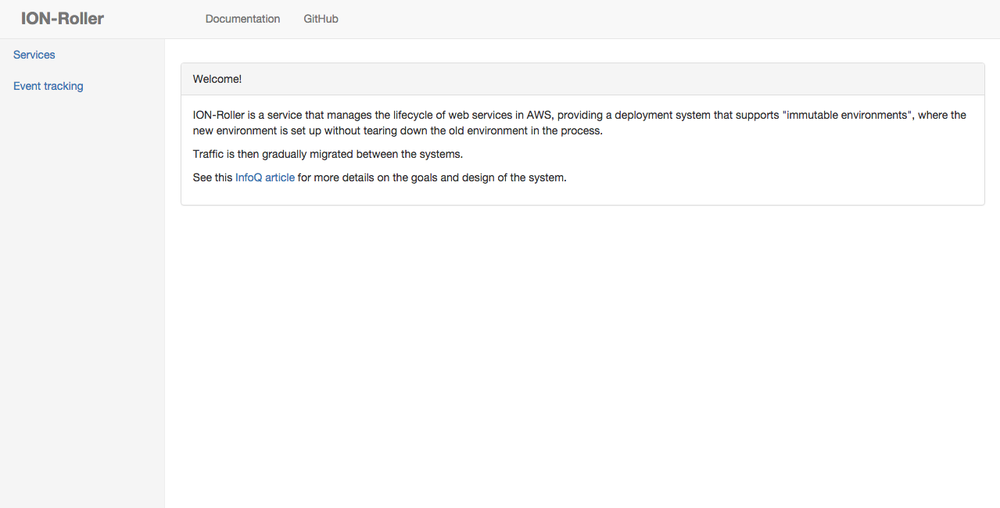
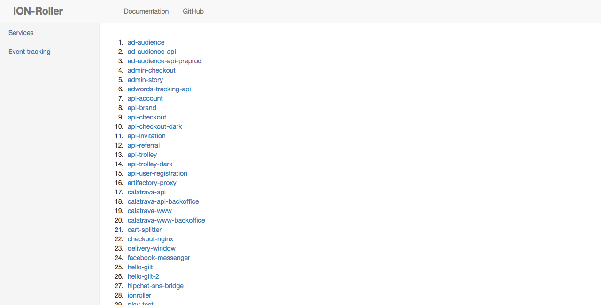
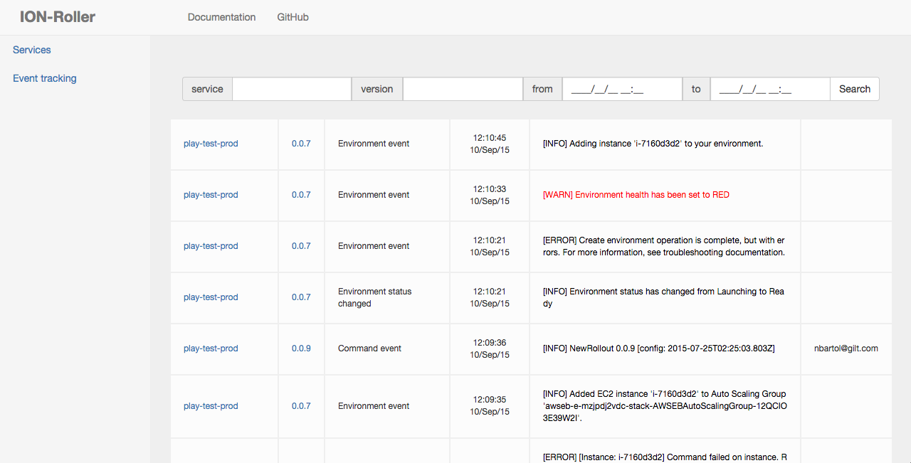

# Setting up ION-Roller service and ION-Roller CLI

## Install ION-Roller CLI

```bash
curl -s https://s3.amazonaws.com/ionroller-cli/install | sh
```

## Test that ION-Roller CLI works properly:

```bash
ionroller 
```
should display the list of available commands, i.e.

```bash
ionroller 
v0.0.124

Usage: ionroller COMMAND [--base BASE_URL]

Available options:
  -h,--help                Show this help text
  COMMAND                  Command to run
  --base BASE_URL          Base URL for ionroller service

Available commands:
  release                  Release version: ionroller release SERVICE VERSION [-c|--conf
                           ISO_8601_DATE]
  drop                     Drop version: ionroller drop SERVICE VERSION [-c|--conf
                           ISO_8601_DATE] [--force]
  events                   Show events for service: ionroller events SERVICE [VERSION]
                           [-f|--from ISO_8601_DATE] [-t|--to ISO_8601_DATE]
  config                   Get configuration: ionroller config SERVICE [-t,--timestamp
                           ISO_8601_DATE]
  set_config               Set configuration: ionroller set_config SERVICE [FILE]
  delete_config            Delete configuration: ionroller delete_config SERVICE
  configs                  Get configuration history timestamps: ionroller configs
                           SERVICE [-f|--from ISO_8601_DATE] [-t|--to ISO_8601_DATE]
  current                  Get current version: ionroller current SERVICE
  update                   Update ionroller CLI
  setup                    Setup ionroller service
  version                  ionroller version
  set_base_url             Set ionroller base URL
  set_client_update_url    Set ionroller CLI update URL
```

## Deploy ION-Roller with ION-Roller CLI (so meta... ;-) ). 

First create the configuration for your ION-Roller service.

Fill all required values in the configuration template below and save it as ionroller-config.json.

**Configuration template for ION-Roller service**:

<table cellpadding="10">
    <tr>
        <td>
       <pre><code>{
   "url":<a href ="gettingStarted.md#decide-on-the-domain-for-your-services">"ionroller.&lt;YOUR_DOMAIN&gt;"</a>, 
   "hosted_zone_id":<a href ="gettingStarted.md#decide-on-the-domain-for-your-services">"&lt;HOSTED_ZONE_ID&gt;"</a>,
   "aws_account_id":<a href ="gettingStarted.md#prepare-aws-account">"&lt;AWS_ACCOUNT_ID&gt;"</a>,
   "service_role":"ionroller",
   "image":"<a href="https://hub.docker.com/r/giltouroboros/ionroller/">giltouroboros/ionroller</a>",
   "port_mappings":[
      {
         "internal":9000,
         "external":9000
      }
   ],
   "run_args":[
        "-Dpidfile.path=/dev/null",
        "-Dionroller.modify-environments-whitelist=ALL",
        "-Dionroller.modify-environments-blacklist=ionroller"
   ],
   "eb":{
      "deployment_bucket":<a href ="gettingStarted.md#create-s3-deployment-bucket">"&lt;DEPLOYMENT_BUCKET&gt;"</a>,
      <a href ="http://docs.aws.amazon.com/elasticbeanstalk/latest/dg/command-options.html">"settings"</a>:[
         {
            "Namespace":"aws:ec2:vpc",
            "OptionName":"VPCId",
            "Value":<a href ="gettingStarted.md#minimum-viable-aws-knowledge">"&lt;VPC_ID&gt;"</a>
         },
         {
            "Namespace":"aws:ec2:vpc",
            "OptionName":"Subnets",
            "Value":<a href ="gettingStarted.md#minimum-viable-aws-knowledge">"&lt;SUBNET_ID&gt;"</a>
         },
         {
            "Namespace":"aws:ec2:vpc",
            "OptionName":"ELBSubnets",
            "Value":<a href ="gettingStarted.md#minimum-viable-aws-knowledge">"&lt;SUBNET_ID&gt;"</a>
         },
         {
            "Namespace":"aws:autoscaling:launchconfiguration",
            "OptionName":"SecurityGroups",
            "Value":<a href ="gettingStarted.md#minimum-viable-aws-knowledge">"&lt;SECURITY_GROUP_ID&gt;"</a>
         },
         {
            "Namespace":"aws:autoscaling:launchconfiguration",
            "OptionName":"InstanceType",
            "Value":<a href="https://aws.amazon.com/ec2/instance-types/">"t2.micro"</a>
         },
         {
            "Namespace":"aws:autoscaling:asg",
            "OptionName":"MaxSize",
            "Value":"1"
         },
         {
            "Namespace":"aws:autoscaling:launchconfiguration",
            "OptionName":"EC2KeyName",
            "Value":<a href ="gettingStarted.md#create-ssh-keys-to-enable-logging-in-to-the-amazon-ec2-instances">"&lt;KEYNAME&gt;"</a>
          }
      ],
      "remove_unused_after_minutes":0
   }</code></pre>
        </td>
        <td valign="top">
<i>Notes</i>
<br/><br/>
<b>url</b>: Unique endpoint for each service hosted_zone_id: Unique for each AWS account!
<br/><br/>
<b>run_args</b>: run arguments for service.<br/><code>pidfile.path=/dev/null</code><br/>is required for restarting Play apps withing Docker container.<br/><code>Dionroller.modify-environments-whitelist</code><br/> is a comma separated list of environments that ION-Roller can modify or ALL for all environments,<br/><code>ionroller.modify-environments-blacklist=ionroller</code><br/> - ION-Roller should not modify itself. Updates of ION-Roller service are done via *emergency-deployment* mechanism.
<br/><br/>
<b>Subnets</b>: There should be a Subnet for each ELBSubnet, with matching availability zones (in the standard cases, the value of Subnets equals that of ELBSubnets)
<br/><br/>
<b>InstanceType</b>: optional; default t2.small
<br/><br/>
<b>MaxSize</b>: must be set to 1 for ionroller
<br/><br/>
<b>EC2KeyName</b>: optional; enables ssh to your instance
<br/><br/>
<b>remove_unused_after_minutes</b>: set to 0 for ionroller service
        </td>
    </tr>
</table>

```bash
ionroller setup /<PATH_TO_CONFIG>/ionroller-config.json
```

This will set up the appropriate role, policy details, and add the ION-Roller configuration into DynamoDB.

Then trigger an actual deployment using the "emergency release" tool, as we do not yet have a running environment:

```bash
ionroller release ionroller <IONROLLER_VERSION> --emergency_deploy
```

\<IONROLLER_VERSION\> matches the latest [ION-Roller Docker Image tag] (https://hub.docker.com/r/giltouroboros/ionroller/tags/).

You will have to manually set the DNS entry (add a weighted DNS entry to the Route53 zone, with weight 0, and set ID "ionroller":

[AWS] (https://console.aws.amazon.com/) -> Route53 -> Hosted Zones

The url for your service should look like 
ionroller.&lt;DOMAIN_NAME&gt;

## Point ION-Roller CLI to ION-Roller service:

```bash
ionroller set_base_url <YOUR_IONROLLER_SERVICE_URL>
```

## Test that ION-Roller CLI works properly:

```bash
ionroller current ionroller
```

should return current version of the service, i.e.

```bash
current: 0.0.124
```

ION-Roller web UI should be available at **\<YOUR_IONROLLER_SERVICE_URL\>**:








# Cross-account deployments

ION-Roller can deploy services to another AWS accounts. 

To enable this you have to create **ionroller** role in the other AWS account. It will be used for cross account access and managing resources.

[AWS] (https://console.aws.amazon.com/) -> Identity and Access Management -> Roles

Role Name: **ionroller**

Select Role Type: **Amazon EC2 (Allows EC2 instances to call AWS services on your behalf.)**

Attach policy: AWSElasticBeanstalkFullAccess and AmazonRoute53FullAccess

Edit Trust Relationship for ionroller role: paste the policy:
```json
   {
     "Version": "2012-10-17",
     "Statement": [
       {
         "Sid": "1",
         "Effect": "Allow",
         "Principal": {
           "AWS": "arn:aws:iam::<IONROLLER_ACCOUNT_ID>:root"
         },
         "Action": "sts:AssumeRole"
       },
       {
         "Sid": "2",
         "Effect": "Allow",
         "Principal": {
           "Service": "ec2.amazonaws.com"
         },
         "Action": "sts:AssumeRole"
       }
     ]
   }
```

*IONROLLER_ACCOUNT_ID:* the AWS account id where ION-Roller service runs

Mind that `"aws_account_id":"<AWS_ACCOUNT_ID>"` in your service config should now point the new AWS account. 

Now you can proceed with [deploying services](deployingServices.md).
